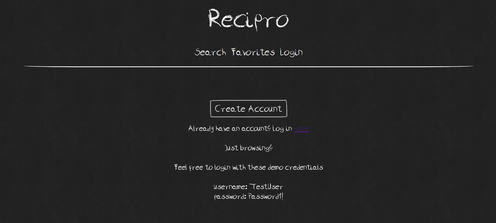
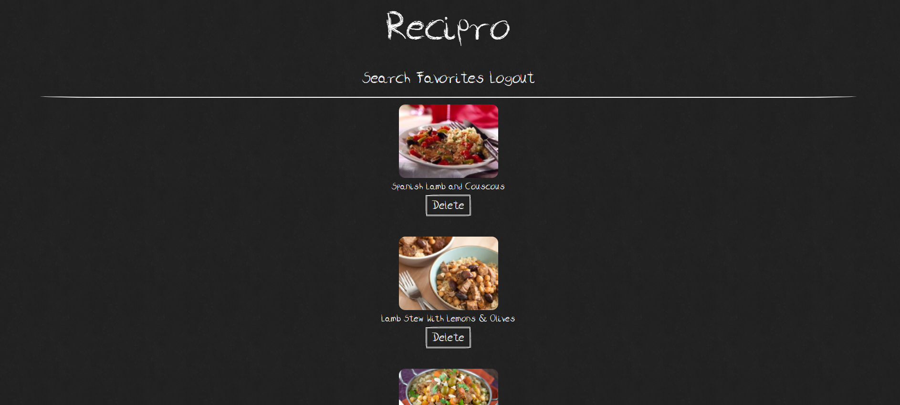

Recipro

The Recipro web app is a creative solution for aspiring home chefs who need fresh ideas on what to cook. 

The app lets users explore recipes based on ingredients they have on hand. Users can include any number of ingredients they want and then search through recipes that include those ingredients. 

Users can also save any of the recipes to their own personalized list.

To set up a personalized list, users must create an account first. Their credentials are encrypted and JSON Web Tokens (JWTs) are used to grant authorization.

Here's a link to the live app: https://recipro-client.vercel.app/

You can access repo to the client app here: https://github.com/KyleEriss/recipro-client

You can access repo to the server app here: https://github.com/KyleEriss/recipro-api

Landing page:

Explore music page:

Playlist page:

Tech used includes React, Node, Express, PostgreSQL, JWTs for authorization, and CSS animations
